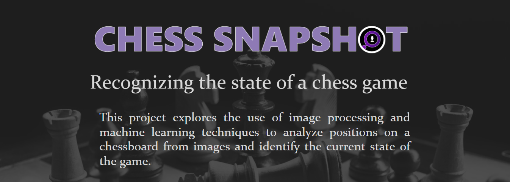
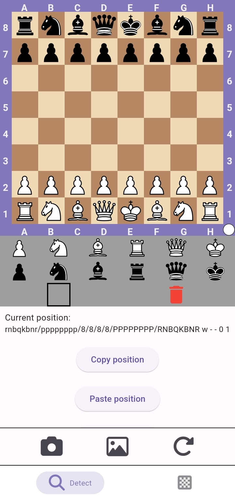
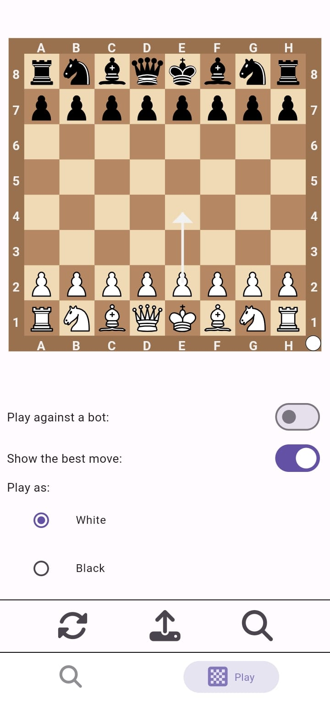

# Chess Snapshot App

The Chess Snapshot App is a Flutter-based application that allows users to capture and analyze chess positions from real-life chessboards. It supports both Android and Windows platforms, offering an intuitive interface to detect and edit chess positions, as well as play against a bot or a local opponent. The app also provides advanced features like Stockfish integration and a transition to Lichess for in-depth analysis.

## Features

### Detect Chessboard Position



- **Capture from Camera:** Take a photo of a chessboard using your device's camera.
- **Select from Gallery:** Choose an image of a chessboard from your device's gallery.
- **Editable Board:** The detected position is represented on an editable chessboard in the "Detect" page.
- **Board Manipulation:**
  - Rotate the pieces by 90 degrees.
  - View the FEN (Forsyth-Edwards Notation) representation of the board.
  - Copy the FEN to clipboard or paste a FEN string to load a position.
  - Interact with the editable board. Move pieces around, remove them and add new ones.

### Play Chess



- **Load Position:** Transfer the detected and validated position from the "Detect" page to the "Play" page.
- **Local Play:** Play the loaded position against another person on the same device.
- **Play Against Bot:** Challenge a bot playing either as black or white.
- **Best Move Suggestions:** Get the best move suggestions powered by Stockfish.
- **Lichess Integration:** Analyze the position further on the Lichess analysis board by pressing the magnifying glass icon.

## Installation

### Prerequisites

- [Flutter](https://docs.flutter.dev/get-started/install)

## Usage

To run the `Chess Snapshot App` on your Android or Windows device, follow these steps:

1. **Clone the repository:**

   ```bash
   git clone https://github.com/tbtiberiu/chess_snapshot_app.git
   cd chess_snapshot_app
   ```

2. **In another terminal window clone the [Chess Snapshot API](https://github.com/tbtiberiu/chess_snapshot_app.git) project and set it up and running.**

### Android

3. **Build the APK:**
   ```bash
   flutter build apk
   ```
4. **Install the APK:**
   ```bash
   flutter install
   ```

### Windows

3. **Build the Windows Executable:**
   ```bash
   flutter build windows
   ```
4. **Install the Application:**
   ```bash
   flutter install
   ```

## Usage

1. **Detect Chessboard:**

   - Launch the app and navigate to the "Detect" page.
   - Use the camera to take a picture of the chessboard or select an image from your gallery.
   - Edit the detected position if necessary, rotate pieces, and manage the FEN string as needed.

2. **Play a Game:**
   - On the "Play" page, load the position from the "Detect" board.
   - Choose to play locally against another person or against the bot.
   - Use the best move feature for guidance, or head to Lichess for a more detailed analysis.

## Acknowledgments

This project is based on advanced computer vision techniques and was supervised by Lect. Dr. Ioana Cristina Plajer.

**Read More:** [Chess Snapshot Full Documentation in Romanian (PDF)](ChessSnapshot.pdf)

## Additional Resources

- [Chess Position Detector GitHub Repository](https://github.com/tbtiberiu/chess-position-detector.git)
- [Chess Snapshot App GitHub Repository](https://github.com/tbtiberiu/chess_snapshot_app.git)

<p align="center">
  
</p>
